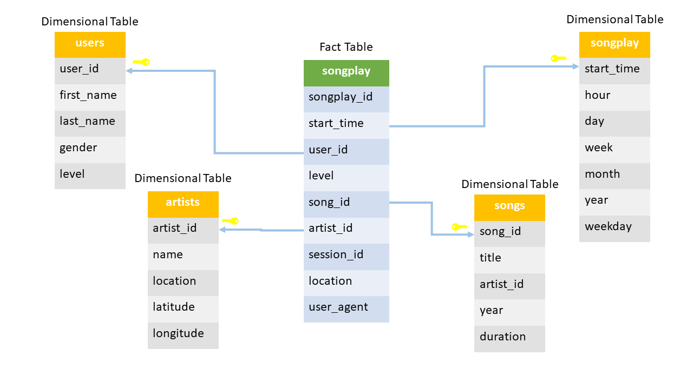

<h1>Project 3: Data Warehouse</h1>

<h2>Project Discription</h2>

In this project, a music streaming startup, Sparkify, want to move their processes and data onto the cloud due to the grow in their user base and song database. They require a data engineer to build an ETL pipeline that extracts their data from S3, stages them in Redshift, and transforms data into a set of tables for their analytics team analysis purposes.

There are two datasets, song data and log data, in the S3. The song dataset continue metadata about a song and the artist of that song. The log dataset consists of log files based on the songs in the song dataset.

<h2>The Analysis Schema</h2>

 
From song and log datasets you'll need to create a star schema optimized for queries on song play analysis. This includes the following tables.

Fact Table:

<ul>
<li>songplays - records in event data associated with song plays i.e. records with page NextSong</li>
</ul>

Dimension Tables:

    
<ul>
<li>users - users in the app</li>
<li>songs - songs in music database</li>
<li>artists - artists in music database</li>
<li>time - timestamps of records in songplays broken down into specific units</li>
</ul>

The figure below shows the schema and identifying the primary key for each table. a sort key was assigned to the primary key for each table and an all distribution style was chosen for users and time tables due to their small number of rows comparing to other tables. 

<h2>Project Components</h2>

The project consists of four files:

The AWS Redshift file, dwh.cfg, include the required information used to connect the project to the AWS Redshift cluster.

The queries file, sql_queries.py, which contain the queries used for the ETL pipeline process. Drop tables queries will be used to drop any existing tables to prepare the database for the ETL process. Create tables queries will be used to create the staging tables (staging_events and staging_songs) for the dataset files and the analysis tables (songplays, users, songs, artists, time). Staging tables queries will be used for copying the data from the log and song datasets files into the staging tables. Final tables queries will be used to insert the required data into the analysis tables.

The remaining two files are used to execute the queries in the sql_queries.py file. The create_tables.py file used to execute the drop and create tables quires. The etl.py file used to execute the copying queries to copy data from the S3 to the staging tables and the insert queries to insert the cleaned data into the analysis tables.

<h2>Running the Project</h2>

To run the project, a Redshift cluster must be prepared for the ETL pipeline and Provide the connection settings and IAM role in the dwh.cfg file to establish a proper connection to the Redshift cluster.

Run create_tables.py file to create the tables and prepare the database. Run etl.py file to extract the data from the dataset files, store them in the staging tables, and transforms them into a set of dimensional tables.

